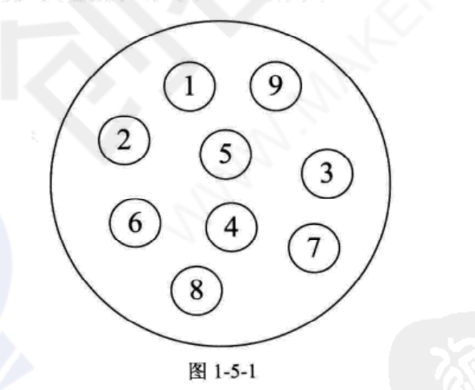
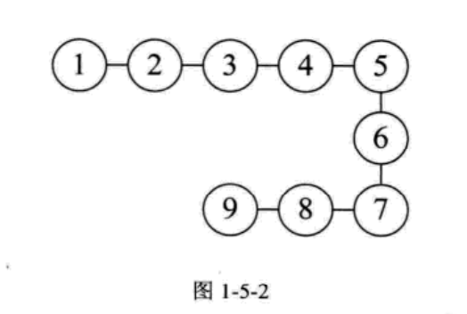
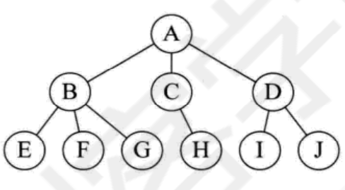
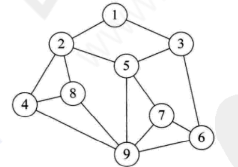
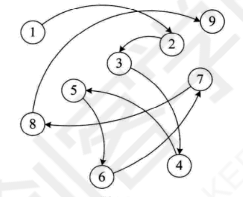

## 一 数据结构概念

在实际开发中，往往需要将许多数据分门别类处理，我们需要为这些数据开辟存储空间进行存储。不同类数据往往存储的要求不一致，当数据存储进一个变量后，有些需求要求能够快速查找出某个单独的数据，有些需求要求能够快速存储。  

根据这些需求而生成的不同数据存储容器我们称之为数据结构，我们最熟知的数据结构就是数组。  

数据结构：相互之间存在一种或多种特定关系的数据集。  

开发中常见的数据结构有：数组、双向链表、二叉树等等。

## 二 数据结构的逻辑结构

#### 2.1 何谓逻辑结构

逻辑结构：数据对象中各个元素之间的相关系。  

逻辑结构有四种：
- 集合结构
- 线性结构
- 树形结构
- 图形结构

#### 2.2 逻辑结构之 集合结构

集合结构中的数据元素除了同属于一个集合外，它们之间没有任何关系。即各个元素之间是完全平等的，彼此之间只有一个关系：同属于一个集合。

#### 2.3 逻辑结构之 线性结构

线性结构中的数据元素之间是一对一关系。

#### 2.4 逻辑结构之 树形结构

树形结构中的数据元素之间是一对多关系。

#### 3.5 逻辑结构之 图形结构

图形结构中的数据元素之间是多对多关系。

## 三 数据结构的物理结构

#### 3.1 何谓数据结构的物理结构

物理结构：数据的逻辑结构在计算机中的真实存储形式。  

在第三节说了很多数据的逻辑结构，这些逻辑结构是要在物理结构中实现的，否则也就失去了逻辑的意义。  

#### 3.2 物理结构之 顺序结构

顺序结构是把数据元素存放在连续的存储单元里，其数据间的逻辑关系和物理关系是一致的。

最经典的顺序结构就是数组了，数组中的元素都是依次摆放的。

#### 3.3 物理结构之 链式结构

顺序结构无法解决插队等问题，很多数据要求存储的结构具有变化性。比如在银行办理业务时，按顺序结构领了排队号码，但是在等待期间，你自己是可以随处走动的。那么形容人在等待时期的一系列动作数据的存储，就需要链式结构。

#### 3.4 物理结构和逻辑结构关系

逻辑结构是面向问题的：实际业务中，我们需要什么样的数据结构，要根据业务出发选择合适的结构。  

物理结构是面向计算机的：选型了逻辑结构后，还需要将这些数据按照逻辑结构规范存储进计算机中。

