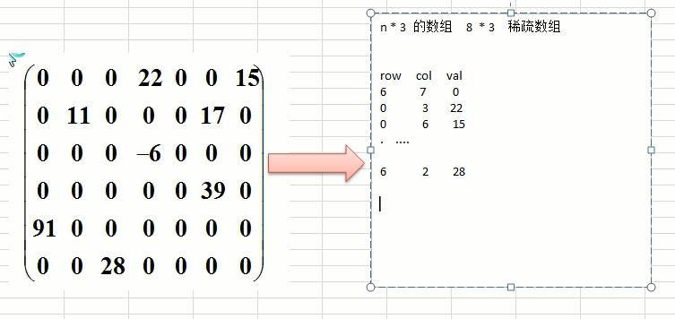

## 一 稀疏数组

### 1.1 问题的引入

如下所示的五子棋程序，有存盘退出和续上盘的功能：  


如果使用二维数组来存储，就会如右侧所示存储很多为0的浪费空间。  

#### 1.2 稀疏数组存储数据

当一个数组中大部分元素为0，或者为同一个值的数组时，可以使用稀疏数组来保存该数组，其处理方式为：
- 记录数组一共有几行几列，有多少个不同的值
- 把具有不同值的元素的行列/值记录在一个小规模数组中

如图所示：  
   

图中的row，col，val分别代表有多少行，多少列，对应值，其中第一条数据6，7，10存储了左侧数据总计有6行，7列，10个不同值。  

#### 1.3 原始数组转换为稀疏数组

```go
/*
 *  稀疏数组
 */
package sparsearray

type node struct {
	row 	int
	col 	int
	val 	interface{}
}

type SparseArray struct {
	data 			[]node
	lengthRow		int
	lengthCol 		int
}

func NewSparseArray(originArr [][]interface{}) *SparseArray{

	var sparseArr []node

	for i1, v1 := range originArr {
        for i2, v2 := range v1 {
            if v2 != nil {
                tempNode := node{
                    row : i1,
                    col : i2,
                    val : v2,
                }
				sparseArr = append(sparseArr , tempNode)
            }
        }
	}

	return &SparseArray{
		data: 			sparseArr,
		lengthRow:  	len(originArr),
		lengthCol: 		len(originArr[0]),
	}
}

// 稀疏数组转普通数组
func (sa *SparseArray)TransToArray() [][]interface{}{

	// 构建一个二维切片
	originArr := make([][]interface{},  sa.lengthRow)
	for k, _ := range originArr {
		resultArr := make([]interface{}, sa.lengthCol)
		originArr[k] = resultArr
	}

    for _, v := range sa.data {
		originArr[v.row][v.col] = v.val
	}
	return originArr
}
```
