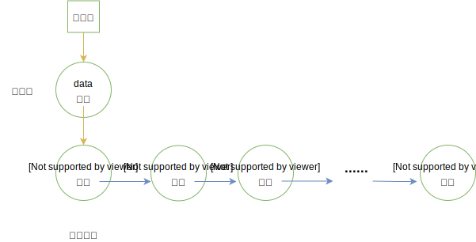

 ## 一 链表

### 1.1 链表概述

回顾顺序表：  

顺序表的底层由数组实现，顺序表逻辑关系上的相邻元素在物理位置上也相邻，这让顺序白可以随机存取表中任一元素，但是在很多编程语言中，数组的长度是固定的，所以当数组已被数据填满时，再要加入新的元素就会非常困难。在数组中，添加和删除元素也很麻烦，因为需要将数组中的其他元素向前或向后移动。   

上述问题出现的原因是：所有的元素存储位置都是相邻的，中间没有缝隙，也就不能快速插入，同样，删除后留下的空隙也需要弥补上。  

链表：
> 用一组任意的存储单元存储线性表中的数据元素，其存储单元可以是连续的，也可以是不连续的

如图所示：  
   

总结：对于插入或者删除数据越频繁的操作，链表的效率优势越明显。  

### 1.2 链表的节点  

链表的定义意味着链表的数据元素可以利用内存中未被占用的任意位置，那么我们需要知道数据元素的前驱、后继时就无法像顺序表那样直接利用索引来查询了，所以在链表的数据结构中，除了要存储数据元素信息外，至少还要存储它的后继元素的存储地址。  

结点node：
> 链表中的每个数据元素a<sub>i</sub>，既要存储本身信息，也要存储后继信息，这两部分组成的数据元素a<sub>i</sub>称为结点（node）

一个节点包含两个域：
- 数据域：存储数据元素信息
- 指针域：存储直接后继的位置，指针域中存储的信息称为指针或者链

n个节点链结成了一个链表，即是线性表的链式存储结构。  

## 二 头指针与头结点

在顺序表中，我们申请了一个数组，并使用引用变量表示该数组，链表中这些无数的数据无法也需要一个引用数据来标识。头指针即是指向链表第一个元素的指针，沿着头指针可以直接查找到链表中的所有元素位置，所以可以在数据结构中使用头指针来表示链表。  

如下图所示：  
  
  


为了方便对链表进行操作，有时候会在单链表的第一个节点前附设一个结点，称为头节点。头节点的数据域一般不存储任何信息，或者存储如线性表的长度等附加信息。头节点的指针域存储指向第一个节点的指针。  

如图所示：   

 
  

头指针：
- 指向第一个节点的指针，若链表有头节点，则指向头节点
- 头指针具备标识作用，常用头指针冠以链表的名字
- 无论链表是否为空，头指针均不为空，是必要元素

头节点：
- 为了操作的统一设立，放在第一个节点之前，一般没有实际意义
- 有了头结点，第一节点前插入、删除第一节点等操作会更加简便
- 头节点不是链表必备元素 

## 三 单链表  

单链表：
> 链表的指针域中只包含一个指针域，即称为线性链表或者单链表

单链表的最后一个元素没有直接后继，即其指针为空。  

但是如果我们不知道第i个结点的位置，单链表数据结构在插入和删除操作上，与线性表的顺序存储结构相比没有太大优势。一旦知道精确的位置，无论插入多少个元素，找到第i位置的指针复杂度为O(n)，但是插入只是简单的移动指针，时间复杂度都是O(1)，而顺序表，每次移动都是O(n)。  

## 四 单链表抽象数据类型

定义链单链表每个节点名为Node，其链表名为LinkList。这里采用带头结点的做法，如图所示：   

 

取巧的地方是：LinkList本身其实可以看做一个Node，即头结点，内部的指针域是链表的首元节点，数据域是链表的长度。也就是说上图的第一个方框其实也是一个Node类型！这样能够有效节省内存空间，避免不必要的浪费。  

这是目前绝大多数教材所采用的链表写法，但是笔者不赞同。如果Node中数据不是整型，而是字符、字符串等其他类型，那么会让链表本身中的data不能再存储长度值，或者说需要一定的抓换，造成操作上的不便，笔者在C语言以及其他语言中，对链表采用如下定义方式：
```c
// 链表结结点结构体
typedef struct LinkNode {
    ElemType            data;       // 数据域
    struct  LinkNode    *next;      // 指针域
}LinkNode;

// LinkList本身可以看做头结点，其data是长度，next是首元节点
typedef struct LinkList{
    int                 length;       // 数据域
    struct  LinkNode    *first;      // 指针域
} LinkList;  

// 申请一个链表
struct LinkList L;                      
LinkListInit(&L);
```

笔者的书写规范：尽量不依赖length做循环，而是依赖于`while(current->next != NULL)`。因为后续会有循环链表、双向循环链表的实现，都可以依照该条件进行循环，而使用for和length进行配合循环，会造成多处不统一现象。  


