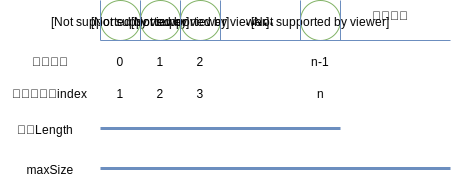

# 02-顺序表

## 一 顺序表概述

顺序表是用一段地址连续的存储单元依次存储线性表的数据元素。

顺序表是线性表在物理上顺序存储的具体实践，如图所示：



从图中看出顺序表的特点：

（1）顺序表的逻辑顺序与物理顺序一致，第 i 个元素存储于第 i-1 的物理位置上。
（2）顺序表的所有元素都可以进行随机访问、顺序访问（下标访问）。
（3）顺序表中数据元素的数据类型即是其内部的数组的数据类型。

如果一个数据元素占据了 c 个存储单元(`sizeof(ElemType)`)，那么第 i 个元素的存储位置为：

$LOC(a_i) = LOC(a_1) + i\times c$

通过上述公式，可以随时计算出顺序表中任意位置的地址，不管是最后一个还是第一个，都是相同的时间。

## 二 顺序表的结构与存取

### 2.0 基本结构

由于顺序表的特性，其底层可以采用数组进行存储，这个底层可以是静态数组，也可以是动态申请的数组。

由于底层采用数组，顺序表的插入与删除也和数组的插入删除一样，会造成大量元素的移动。

如果元素插入到最后一个位置，或者删除最后一个位置，那么之前的数据元素无需排序，此时是最好的情况，时间复杂度为 O(1)，因为不需要移动元素。如果是其他情况，则所有的数据元素都要进行移动，这个时间复杂度为 O(n)。

### 2.1 查找效率

根据值查找位置时，如果查找的元素正好是第一位，则数据比较次数为 1，如果是最后第 n 位，则数据比较次数为 n。

若各个元素的查找概率为 $p_i$，找到该元素时数据比较次数为 $c_i$，那么查找的平均比较次数 ACN（Average Comparing Number）为：

$ACN = \sum_{i=1}^n p_i \times c_i$

若仅考虑概率相等的情况，有 $p_1 = p_2 = ... = p_n = 1/n$，且查找第一个元素的比较次数为 1，第二个袁术的比较次数为 2，第一个元素的比较次数为 i，则：

$ACN = \sum_{i=1}^n (\frac{1}{n}) \times i = \frac{1}{n} \sum_{i=1}^n i = (\frac{1}{n})  \times (1+2+...+n) = \frac{1+n}{2}$

即查找要平均比较 $\frac{1+n}{2}$ 个元素。

### 2.2 插入效率

插入到第 i 个元素位置之前（1<=i<=n+1），应该把数组内的 n-i+1ge 元素向后移动一个位置。最好的情形是在最后一位插入，移动 0 个元素，最坏情形是在第一个元素位置插入，移动了 n 个元素，平均移动次数为：

$ACN = \frac{1}{n+1} \sum_{i=1}^{n+1} (n-i+1) = \frac{1}{n+1}  \times \frac{n(n+1)}{2} = \frac{n}{2}$

### 2.3 删除效率

删除最后一个元素，移动次数为 0，删除第一个元素时，移动次数为 n-1，删除第 i 个元素，移动元素为第 i 个到第 n-1 个，平均移动次数为：

$ACN = \frac{1}{n} \sum_{i=1}^{n} (n-i) = \frac{1}{n}  \times \frac{n(n-1)}{2} = \frac{n-1}{2}$

## 三 顺序表实现

### 3.1 顺序表 C 语言实现

为了简便，这里不考虑数组扩容，缩容问题，简单申请一个数组即可：

```c++

```

### 3.2 顺序表 Go 语言实现

```go
/**
*  顺序表
*/

package list

import (
 "fmt"
)

const SqListSize = 5

// 顺序表结构体
type SqList struct {
 items     []interface{}  // 线性表内数据
 cap     int          // 该线性表最大容量
 length   int          // 该线性表元素个数
}

// 构造实例
func NewSqList() *SqList {
 return &SqList{
  items:  make([]interface{}, SqListSize),
  cap:     SqListSize,
  length:  0,
 }
}

// 增：在末尾追加元素
func (l *SqList)PushBack(e interface{}) {

 // 容量已满，申请新空间
 if l.length == l.cap {
  newArr := make([]interface{}, l.cap * 2)
  copy(newArr, l.items)   // 拷贝原有元素到新的切片中
  l.items = newArr
  l.cap = l.cap * 2
 }

 l.items[l.length] = e
 l.length++
}

// 增：任意位置插入元素
func (l *SqList) Insert(index int, e interface{}) bool {

 // 如果索引越界
 if index < 1 || index > l.length + 1 {
  fmt.Println("插入位置不正确")
  return false
 }

 // 如果是空表
 if l.length == 0 && index == 1 {  // index此时必定是1
  l.items[0] = e
  l.length++
  return true
 }

 // 容量已满，申请新空间
 if l.Length() == l.Cap() {
  fmt.Println("申请新容量")
  newArr := make([]interface{}, l.Cap() * 2)
  copy(newArr, l.items)   // 拷贝原有元素到新的切片中
  l.items = newArr
  l.cap = l.Cap() * 2
 }

 // 执行插入
 for i := l.length + 1; i > index; i-- {
  l.items[i - 1] = l.items[i - 2]
 }
 l.items[index - 1] = e
 l.length++
 return true
}

// 获取顺序表长度
func (l *SqList)Length() int {
 return l.length
}

// 获取顺序表容量
func (l *SqList)Cap() int {
 return l.cap
}

// 清空
func (l *SqList)Clear() {
 l.length = 0
 l.items = make([]interface{}, l.Cap())
}
```

### 3.3 顺序表 JavaScript 实现

$$
$$
