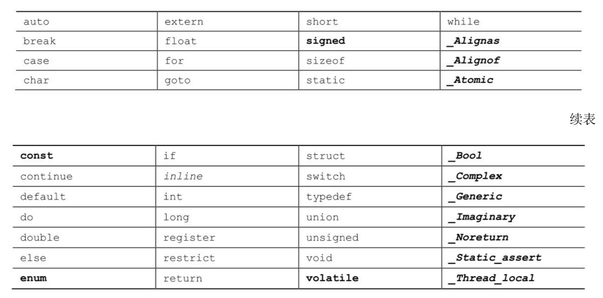

## 一 C语言简介

#### 1.1 C语言的发展

1972年，为了移植与开发`UNIX`操作系统，丹尼斯·里奇(Dennis Ritch)与肯·汤普逊（Ken Thompason，同时也是Go语言与Unix作者）在贝尔实验室设计开发了`C`语言。  

C语言是基于汤普逊发明的B语言基础上进行的设计。  

1978年，布莱恩·柯林汉（Brian Kernighan）和丹尼斯·里奇（Dennis Ritchie）制作了`C`的第一个公开可用的描述，现在被称为`K&R`标准。  

C语言没有自己的默认标准库，其Unix实现的标准库称为了标准库。  

1989年，ANSI C标准库公布（83年开发），且于1990年被国际标准组织（ISO）采用，该套标准ANSI/ISO的最终版称为C89或者C90。  

1999年，ANSI/ISO联合委员会发布C99标准，C支持了国际化编程，解决了一些实际缺陷（64位移植），提高了实用性（科学计算），该标准在2001年和2004年又进行了修正。   

2011年，C11标准发布，但并未赢得各大供应商支持。

#### 1.2 C语言特性

C语言是一种用途广泛，使用灵活的过程性（procedural）编程语言，其主要特点：
- 语法简洁：共有37个关键字，9种控制语句，使用方便，灵活
- 功能丰富：34种运算符，多种数据类型
- 结构化控制语句：C语言是完全模块化和结构化的语言
- 可移植性：在一种系统编写的C程序稍微修改（修改头文件）后即可在其他系统运行
- 目标代码质量高：C本来是为编写系统软件而设计，其目标代码质量高，程序执行效率高
- 支持访问物理地址：C允许直接访问物理地址，能进行位（bit）操作，能实现汇编语言的大部分功能
- 语法限制不严格：程序设计的自由度很大，比如对数组下标越界不检查，这带来了开发便捷的同时也让编译后的结果出现不确定性，是把双刃剑（所以不要过分依赖C编译程序查错）。

#### 1.3 C语言标准

C 语言是一种通用的、面向过程式的计算机程序设计语言，当前最新的C语言标准为 C11 ，在它之前的C语言标准为 C99（见1.1）。  


#### 1.4 C语言作用

C 语言最初是用于系统开发工作，特别是组成操作系统的程序。由于 C 语言所产生的代码运行速度与汇编语言编写的代码运行速度几乎一样，所以采用 C 语言作为系统开发语言，经常用于开发：操作系统，语言编译器，数据库，驱动等。

## 二 C语言环境搭建

最常用的C语言编译器是GNU的C/C++编译器。

```
gcc -v              # 查看机器上gcc版本，如果已安装，则会出现提示
```

如果提示未安装：
```
Mac：直接下载Xcode即可
Linux：http://gcc.gnu.org/install/
Win：下载MinWG，至少要安装 gcc-core、gcc-g++、binutils 和 MinGW runtime，并配置环境变量（MinGW 的 bin 子目录到您的 PATH 环境变量中）
```

## 三 HelloWorld

C语言文件都是`.c`后缀名结束，创建`hello.c`文件：
```c
#include <stdio.h>                       
 
int main(){                             

    printf("Hello, World! \n");         
 
    return 0;
}
```

编译与运行：
```
gcc hello.c         # 可以添加参数 -o hello 则会生成 hello二进制文件
./a.out             # win上生成的程序为 a.exe
```

贴士:
- #include <stdio.h>  预处理指令
- 程序总是从main函数开始，即main函数是入口函数

## 四 C程序的执行步骤

- 1. 编辑源程序
- 2. 对源程序进行编译：
    - 先预编译：即用C编译系统对预处理指令进行预处理，比如将HelloWorld种的`include`部分内容读取出来代替改行文本。
    - 再正式编译：先进行语法检查，然后转换为二进制目标程序
- 3. 连接：编译后的二进制目标文件不能被计算机直接执行，因为一个程序可能由很多源文件组成，编译只是将当前源程序文件编译为目标文件，只是整个程序的一部分，必须把所有编译后得到的目标模块连接起来，再与函数库向连接称为一个整体，最后生成一个**可执行程序**（executive program）。连接工作由连接编辑程序完成（linkage editor）。
- 4. 运行：运行可执行程序，得到结果

## 五 C语言编译环境  

#### 5.1 UNIX环境  

UNIX可以使用自带的cc命令编译C源程序，但是该编译器没有跟上标准发展的脚步，已经退出了历史舞台。通常，现在的UNIX系统提供的C编译器都来自其他源，然后以cc命令作为编译器的别名，如下所示：
```
cc main.c
```

#### 5.2 GUN编译器集合

GNU编译器现在是包含很多语言的编译器合集，包括C的编译器GCC。GCC有很多版本以适应不同的硬件平台和操作系统，其调用命令如下：
```
gcc main.c      # 当然许多系统也使用cc作为gcc的别名

// 不同版本的gcc
gcc -std=c99 main.c
gcc -std=c1x main.c
gcc -std=c11 main.c
```

#### 5.3 LLVM

LLVM是cc的另一个替代品，其编译器Clang是FreeBSD的默认C编译器，当然他也使用cc别名。

```
cc -v           # 查看版本
```

#### 5.4 PC下编译C语言

C编译器不是Windows软件包的一部分，需要下载类似Cygwin或者MinGW这样的GCC编译器。  

当然微软也拥有自己的一套标准：VC++。


## 六 C语言的关键字与标识符




