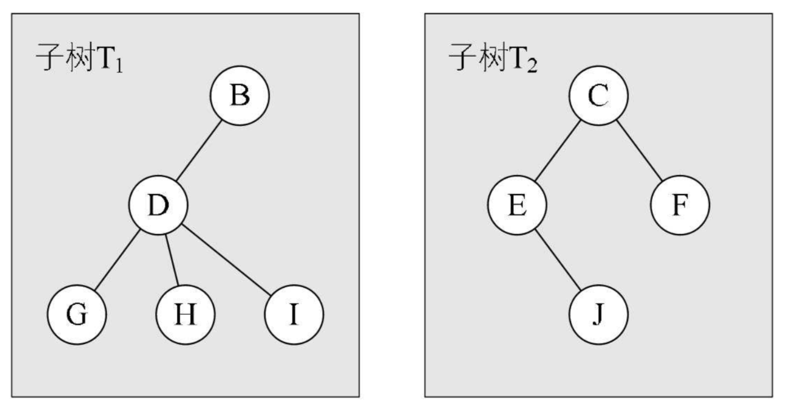
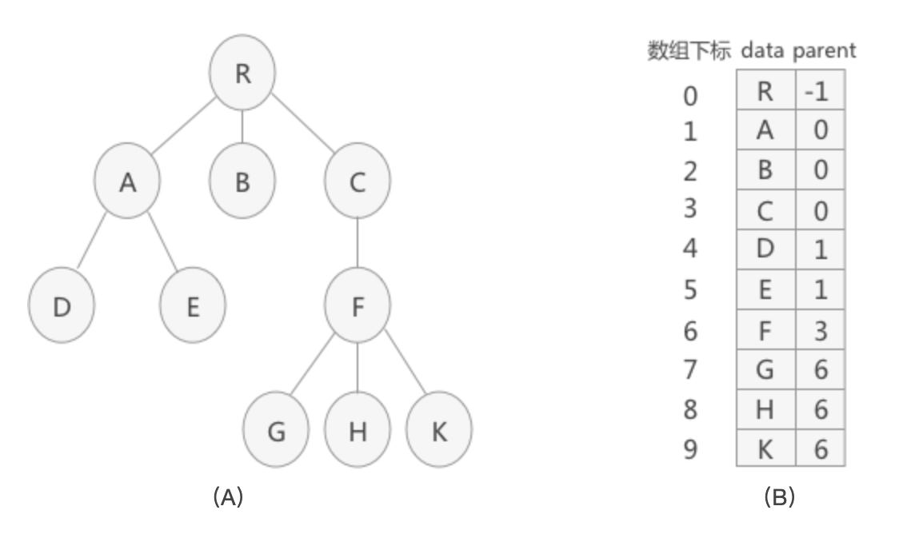

## 一 树的简介

### 1.1 树形结构

线性表中具体的单个元素之间的关系是一对一的线性结构。现实中，仍然有很多一对多的情况，比如：文件系统中不同层级的文件，公司的行政架构图。此时可以用树（Tree）来标识，树是一种非线性数据结构，经常用来存储具有层级关系的数据，它是n（n>=0）个节点的有限集，n=0时称为空树。  

在任意一棵非空的树中：
- 有且仅有一个特定的根节点(Root)
- 当n>1时，其余节点可分为m（m>0）个互不相交的有限集T<sub>1</sub>、T<sub>2</sub>....、T<sub>m</sub>，其中每一个集合本身又是一棵树，并且称为根的子树（SubTree）

如图所示:   


### 1.2 树的理解

树的定义其实采用了递归的方法，如图所示，两个子树其实是根节点A的子树，当然D,G,H,I组成的树又是B为根节点的子树，以此类推：  



除了要主要根节点的唯一性以外，子树之间一定是互不相交的，如下所示并不符合树的定义：


树的相关术语：
- 父节点：下方连接多个节点
- 子节点：父节点下的节点
- 度(De-gree)：拥有的子树数，树本身的度是树内各节点的度的最大值
- 叶节点(Leaf)：没有子节点的节点，即度为0，也称为终端节点
- 分支节点：度不为0的节点，也称为非终端节点，除了根节点外，分支节点也可以称为内部节点


节点的层次（Level）：根节点作为第一层，其孩子为第二层。  


有序树与无序树：
- 有序树：树中的节点的各个子树看成从左至右有次序不可互换
- 无序树：与有序树相反


## 二 树的存储结构

简单的顺序存储肯定不能满足树的关系（父子）。树的存储结构主要有三种：双亲表示法，孩子表示法，孩子兄弟表示法。 

### 2.1 双亲表示法

树的每个节点不一定有孩子，但是一定有且仅有一个双亲节点（根节点除外），所以可以通过其双亲表示一个完整的树。  

双亲表示法的数据结构需要存储数据域本身，还要存储一个指向其双亲的指针域。  

```go
type node struct {              // 表示一个节点
    data interface{}            // 数据域：存储节点中的数据
    parent  int                 // 指针域：存储双亲在数组中的下标
}

type Tree struct {
    nodes []node                // 节点指针数组
    root int                    // 根节点位置
    num int                     // 节点数
}
```

其存储的数据格式如下：其中ABCDE分别是各个节点信息。  
  

在上述结构中，可以很容易查找到其双亲节点，时间复杂度为O(1)，parent为-1时，即是根节点。  

此时我们会遇到一个问题：查找节点的子节点时，需要遍历整个结构。  

可以对上述结构进行改进：增加一个节点的最左孩子的域，这样就能轻易得到节点的孩子，如果没有孩子节点，整个最左孩子域设置为-1。  

但是如果孩子很多，超过2个，又需要关注节点的双亲、孩子、兄弟，那么需要不断的扩展结构，添加其他的域，比如：双亲域、左右兄弟域等等。  


### 2.2 孩子表示法

把每个节点的孩子节点排列起来，以单链表存储，n个节点有n个孩子链表，如果是叶节点，则此单链表为空链表，然后n个头指针组成一个线性表，采用顺序存储结构，放在一个数组中。  

```go
// 孩子节点
type  node struct {
    child int               // 数据域：存储某个节点在表头数组中的下标
    next *node              // 指针域：存储指向该节点的下一个孩子节点的指针
}

// 表头结构
type first struct {
    data interface{}        // 数据域：存储节点数据
    firstchild              // 头指针域：存储该节点的孩子链表的头指针
}

// 树结构
type tree struct {
    nodes []first
    root int
    num int
}

```

### 2.3 孩子兄弟表示法

任意一棵树，它的节点的第一个孩子如果存在就是唯一的，它的右兄弟如果存在也是唯一的，因此设置两个指针，分别指向该节点的第一个孩子和此节点的右兄弟即可。  

```go
type node struct {
    data interface{}
    firstchild *node
    rightchild *node
}
```

上述的表示方法，给查找某个节点的某个孩子带来了方便，只需要通过firstchild找到此节点的长子，然后再通过长子节点的rightsib找到它的二弟，依次类推，直到找到具体的孩子。  

当然如果要找到双亲，依然有困难（添加parent指针域可以解决）。  

孩子兄弟表示法其实是将一棵复杂的树表示为了二叉树。  
