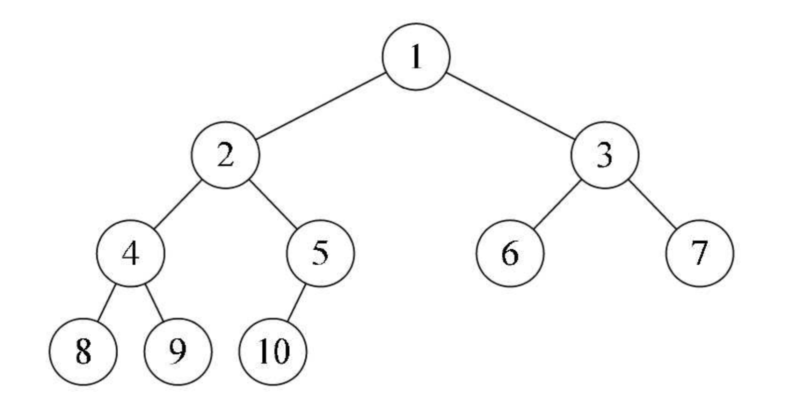

## 一 二叉树定义

> 二叉树（Binary Tree）： 树的每个节点的度最大为2，即最多拥有2棵子树

二叉树有五种形态：
- 空二叉树
- 只有一个根节点
- 根节点只有左子树
- 根节点只有右子树
- 根节点既有左子树又有右子树

注意：二叉树的左子树和右子树是有顺序的，不能任意颠倒，即使树种某个节点只有一棵子树，也要区分它是左子树还是右子树。交换左右子树后生成的新二叉树就不再是以前的二叉树了！！所以二叉树是有序树！  

一些特殊的二叉树：
- 斜树：斜树看起来类似线性结构，有左斜树（只有左侧节点），右斜树（只有右侧节点），此时节点的个数就是二叉树的深度。
- 真二叉树：所有节点的度要么为0，要么为2，英文名 Proper Binary Tree。
- 满二叉树：所有节点的度要么为0，要么为2，且叶节点都在最后一层。英文名 Full Binary Tree。（其实是在真二叉树基础上添加了限制）

## 二 非空二叉树的特性  

- 每层节点数：二叉树的第 i 层上至多有 2<sup>i-1</sup>个 节点（i>=1） 
- 全部节点数：高度为 h 的二叉树至多有 2<sup>k</sup>-1 个节点（h>=1，也是叶节点所在的最大层数）。相应的高度 h = log$_2$n+1  
- 叶节点数与度关系：叶节点数 = 度为2节点数 + 1

叶节点与度关系推导：
```
    n0 是叶节点数，n1 是度为1的节点数，n2 是度为2的节点数，T为二叉树的节点连线总数：
    T = 1*n1 + 2*n2
    T = n - 1
    n = n0 + n1 + n2 
```

其实还可以得到一个公式： n = 2n0 + n1 - 1

如图所示：  


##  三 完全二叉树

### 3.1 完全二叉树概述

> 完全二叉树：叶子节点只会出现在最后2层，且最后1层的叶子节点都靠左对其。英文名 Complete Binary Tree。

完全二叉树如图：  


注意：完全二叉树不一定是满的，但是只要将完全二叉树补充上对应子节点，就是一棵满二叉树。  

也可以推理出：
- 满二叉树一定是完全二叉树
- 完全二叉树的根节点到倒数第二层之间的树是一棵满二叉树

### 3.2 完全二叉树特性

完全二叉树（Complete Binary Tree）的特点：
- 度为1的节点只有左子树
- 度为1的节点要么是1个，要么是0个
- 同样节点数的二叉树，完全二叉树深度最小
- 如果节点度为1，则该节点只有孩子节点，不存在只有右子树的情况

假设完全二叉树的高度为 h ，h >= 1，则：
- 则至少有 2<sup>h-1</sup> 个节点（2$^0$ + 2$^1$ + ... + 2$^h$$^-$$^2$ + 1）
- 则最多有 2<sup>h</sup> - 1 个节点 (2$^0$ + 2$^1$ + ... + 2$^h$$^-$$^1$，满二叉树)

总结点数量 n ： 
- 则：2<sup>h - 1</sup> <= b < 2<sup>h</sup>，
- 也即 h - 1 <= log$_2$n < h，由于h是整数，h = floor(log$_2$n) + 1 (向下取整)


n0 是叶节点数，n1 是度为1的节点数，n2 是度为2的节点数：
```
# 二叉树本身的规律
n = 2n0 + n1 - 1
# 完全二叉树的n1要么是1，要么是0
```

一颗有n(n>0)个节点的完全二叉树，从上到下，从左到右，给节点从1编号，则第i个节点有：
- i=1，是根节点
- i>2，其父节点编号是 floor(i/2)
- 2i<=n，其左子节点编号为2i
- 2i>n，则其无左子节点
- 2i+1<=n，则其右子节点编号为2i+1
- 2i+1>n,则其无右子节点

## 四 二叉树存储结构

树使用顺序存储是非常困难的，但是二叉树结构特殊，使用顺序存储也能实现。即：用一维数组存储二叉树中的节点和节点关系。  


图中4，6，8，9节点不存在。顺序存储虽然能够表述二叉树，但是实用性不强，比如一种极端的情况，树的深度为k，但是是右倾斜树，只有k个节点，却需要分配2k-1个存储单元，造成了空间的极大浪费。  

推荐使用链式存储，即二叉链表：每个节点最多有两个孩子，节点分别设计一数据域、两个指针域，即可表示一个节点。这样的链表叫做二叉链表。  

```go
type node struct {
    data        interface{}
    lchild      *node
    rchild      *node
}
```

二叉链表示意图：  


## 五 最后的注意事项

一些国外的书籍翻译有所不同：
- Full Binary Tree：完满二叉树，即给国内的真二叉树
- Perfect Binary Tree：完美二叉树，即国内的满二叉树
- Complete Binary Tree：完全二叉树，与国内翻译一致