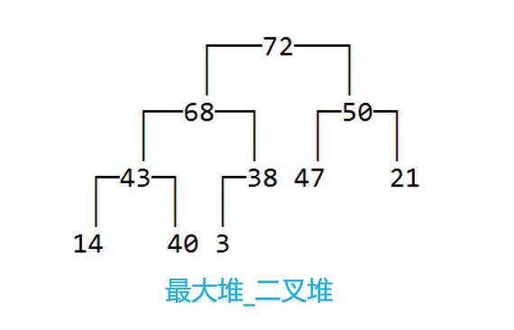
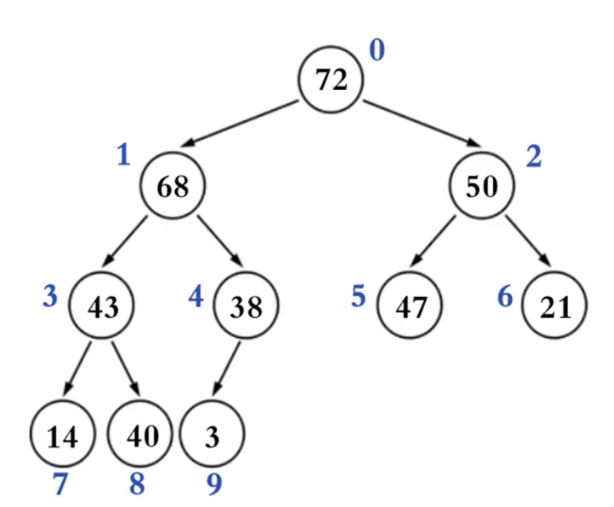

## 一 堆的引入

如果一个数据结构只需要提供：添加元素、获取最大值、删除最大值这样的操作，如果我们使用数组、链表、红黑树实现，则： 

| 数据结构 | 添加元素 | 获取最大值 | 删除最大值 | 说明 |
| --- | --- | --- | --- | --- | 
| 无序双向链表/动态数组 | O(1) | O(n) | O(n) | 效率不高 | 
| 有序双向链表/动态数组 | O(n) | O(1) | O(1) | 只要最大值，却全部排序，造成了浪费 |
| 红黑树 | O(logn) | O(logn) | O(logn) | 过于复杂 |

我们发现上面的数据结构或多或少都有瑕疵，数据结构 `堆` 就是专门为了解决上述问题而设计的，又不失简单性。  

堆还能解决一个重要的大数据问题：Top K 问题，即从海量数据中找出前K个数据!

## 二 堆概念

堆是一种树状的数据结构，常见的堆实现有：
- 二叉堆：Binary Heap，也称为完全二叉堆
- 多叉堆：D-heap、D-ary Heap
- 索引堆：Index Heap
- 二项堆：Binomial Heap
- 斐波那契堆：Fibonacci Heap

堆最重要的性质是：
- 如果任意节点的值总是 >= 子节点的值，称为 最大堆、大根堆、大顶堆
- 如果任意节点的值总是 <= 子节点的值，称为 最小堆、小根堆、小顶堆

   

堆的时间复杂度可实现：
- 获取最大值：O(1)
- 删除最大值：O(logn)
- 添加元素：O(logn)   

## 三 二叉堆

二叉堆的本质是一种完全二叉树，鉴于完全二叉树的一些特性，二叉堆的底层物理结构一般使用数组来实现即可，如图所示：  

  

二叉堆的数组有如下规律：
- 数组索引等于0，即为根节点，堆顶
- 数组索引大于0，则其父节点的编号为 floor((i-1)/2)

假设二叉堆的数组有n个元素，当前节点索引为i：
- 如果：2i + 1 <= n - 1， 则其左子节点编号为 2i+1
- 如果：2i + 1 >  n - 1， 则其无左子节点
- 如果：2i + 2 <= n - 1， 则其右子节点编号为 2i+2
- 如果：2i + 2 <  n - 1， 则其无右子节点

## 四 二叉堆的一些实现

### 4.1 添加

添加元素时，将元素直接放置在数组的最后一位，但是会造成如下现象：  

  

所以还要额外进行元素数据的比较：
- 如果插入的数据大于父节点数据，则与父节点交换数据
- 依次循环，直到插入的数据小于父节点，或者遇到空父节点，退出循环

上述过程称为 上滤（Sift Up），时间复杂度为O(logn)。  

### 4.2 删除

- 1 利用最后一个节点覆盖根节点
- 2 删除最后一个节点
- 3 循环下列步骤：
  - 如果删除节点值小于子节点，则与最大的子节点交换位置
  - 如果删除节点值大于等于子节点，或者没有子节点，则退出循环

上述过程称为 下滤（Sift Down），时间复杂度为O(logn)。  