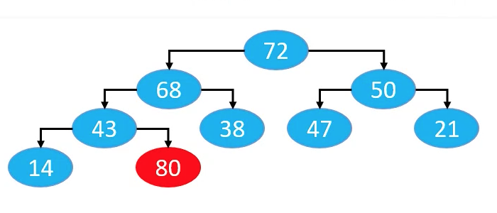

## 一 堆简介

思考1：设计一个数据结构存储整数，要求只用提供三个接口：获取最大值、删除最大值、添加元素。  

此时可以考虑：链表、数组、平衡二叉搜索树（如红黑树），则他们的时间复杂度如图：  

  

虽然看起来红黑树效果更好，但是本题里只需要简单的三个接口，红黑树的实现过于浪费了！  

数据结构堆即可实现：
- 获取最大值：O(1)
- 删除最大值：O(logn)
- 添加元素：O(logn)   

思考2：Top K 问题。该问题及从海量数据中找出前 K 个数据。该问题使用堆数据结构也能很好的解决。 

贴士：这里的堆并不是内存中堆的模型。  

堆（heap）也是一种树状的数据结构，常见的堆实现有：
- 二叉堆：Binary Heap，也称为完全二叉堆
- 多叉堆：D-heap、D-ary Heap
- 索引堆：Index Heap

> 堆的最重要的性质：任意节点的值 总是大于等于或者小于等于其子节点的值
> 最大堆：任意一个节点的值，都大于等于其子节点的值。堆顶(根节点)是最大元素
> 最小堆：任意一个节点的值，都小于等于其子节点的值。堆顶(根节点)是最小元素

如图所示：  
  

## 二 二叉堆

二叉堆的本质是一种完全二叉树，鉴于完全二叉树的一些特性，二叉堆的底层物理结构一般使用数组来实现即可。如图所示：  

  

二叉堆的数组有如下规律：
- 数组索引0即为根节点，堆顶
- 如果索引大于0，则其父节点的编号为 flor((i-1)/2)

假设二叉堆的数组有n个元素，当前节点索引为i：
- 如果：2i + 1 <= n - 1， 则其左子节点编号为 2i+1
- 如果：2i + 1 > n - 1， 则其无左子节点
- 如果：2i + 2 <= n - 1， 则其右子节点编号为 2i+2
- 如果：2i + 2 < n - 1，则其无右子节点

## 三 二叉堆的自我调整

对于一个完全二叉树，如果想让其调整为最小堆，一般都是采用较大值下沉的规律（最大堆类推则是小值下沉）。  

构建二叉堆的本质就是让所有非叶子节点依次下沉。
