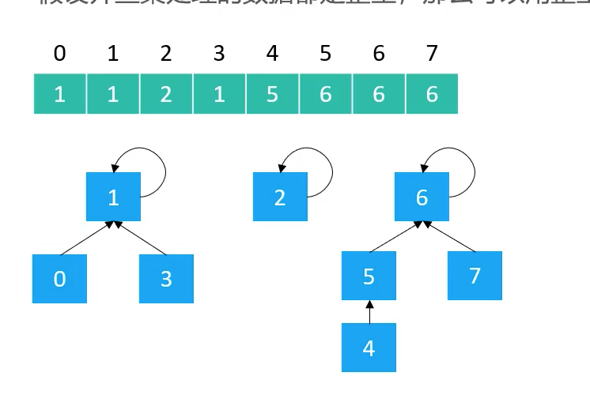
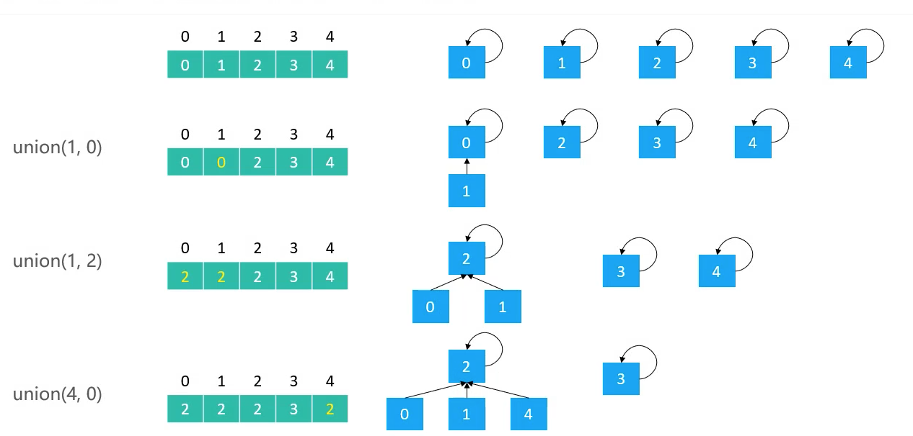
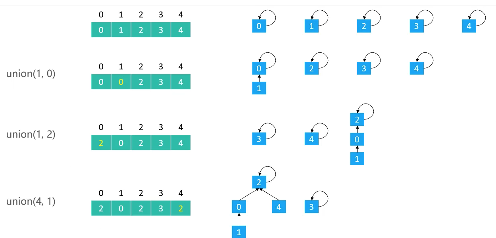

## 一 并查集的引入

假设有n个村庄，如下所示，连线代表这些村庄之间有连接的路：  

  

现在设计一个数据结构，满足下列要求：
- 快速查找2个村庄之间是否有连接的路，比如1和7
- 连接两个村庄，如1和9，连接后，左侧区域其实都可以到达右侧区域了

上述需求使用大多数数据结构都可以实现，但是他们往往存在时间或者空间上的复杂度问题。  

并查集能够做到查询、连接的均摊时间复杂度都是O(α(n)),α(n)<5。**并查集适合处理“连接”相关问题**，如现实生活中查询某个学生是否属于某2个社团，合并两个社团等等。   

## 二 并查集概述

> 并查集：Disjoint Set，也称为不相交集合，主要包含2个操作：
>  查找：Find，查找元素所在的集合（该集合只是广义的数据集合，并不是数据结构Set）
>  合并：Union，将两个元素所在的集合合并为一个集合

并查集使用数组存储数据
- 数组索引：表示并查集的具体元素值
- 数组的值：表示元素所在的集合名，集合名正好使用其根元素表示

如下所示三个集合用数组存储后的效果：  



并查集与二叉堆、优先级队列一致，都是用数组实现的树形结构。在并查集中，属于同一集合的元素，其根节点都是同一个。  

## 三 并查集的实现方式

### 3.0 两种实现方式

并查集有两种实现方式：
- Quick Find：
  - 查找时间复杂度为O(1)
  - 合并时间复杂度为O(n)
- **Quick Union**：
  - 查找时间复杂度为O(logn)，但是可以优化到O(α(n)),α(n)<5
  - 合并时间复杂度为O(logn)，但是可以优化到O(α(n)),α(n)<5

开发中推荐使用 Quick Union。  

### 3.1 QuickFind

该实现方式比较简单：
- 初始化：分配一个底层数组，每个索引对应的元素的值，也是索引的值，这样就表示了每个索引位置都是一个全新的集合，根节点就是元素的值
- 查找：由初始化得知，所在集合即根节点的值，也即索引对应的元素的值
- 合并：合并的两个参数为元素v1，v2，现在让v1合并到v2集合，那么通过查找所在集合函数可以知道v1和v2所在的根节点，然后遍历数组，数组中所有元素值与v1的根节点相同的，都设置为v2的根节点即可

如图所示：  



查找代码：
```go
func find(v int) int {
    if v < 0 || v >= len(parents)  {
        fmt.Println("容量为空")
    }
    return parents[v]
}
```

合并代码：复杂度必定是O(n)
```go
func union(v1, v2 int) {
    p1 := find(v1)
    p2 := find(v2)
    if p1 == p2 {
        return
    }
    for i := 0; i < len(parents)l i++ {
        if parents[i] == p1 {
            parents[i] = p2
        }
    }
}
```

### 3.2 QuickUnion

该实现方式：
- 初始化：分配一个底层数组，每个索引对应的元素的值，也是索引的值，这样就表示了每个索引位置都是一个全新的集合，根节点就是元素的值
- 查找：查找所在集合，即根节点的值，也即索引对应的元素的值
- 合并：合并的两个参数为元素v1，v2，现在让v1合并到v2集合。让v1的根节点转变为v2的根节点，那么通过查找所在集合函数可以知道v1和v2所在的根节点，无需遍历数组，让v1的根节点直接变为v2的根节点
  - 与QuickFind的不同是，这里操作的都是v1和v2的根节点

使用QuickFind形成的树，高度最高只有2，而使用QuickUnion方式实现的树，其高度有可能会远大于2。  

合并的图示：  


解析：
- `union(1, 0)`，将元素1合并到元素0所在的集合，即1位置集合的根节点合并到0所在集合的根节点上
- `union(1, 2)`，将元素1合并到元素2所在的集合，即1位置集合的根节点合并到2所在集合的根节点上。切记：这里操作的都是集合的根节点。
- `union(4, 1)`，将元素4合并到元素1所在的集合，即4位置集合的根节点合并到1所在集合的根节点上。

查找的图示：  


