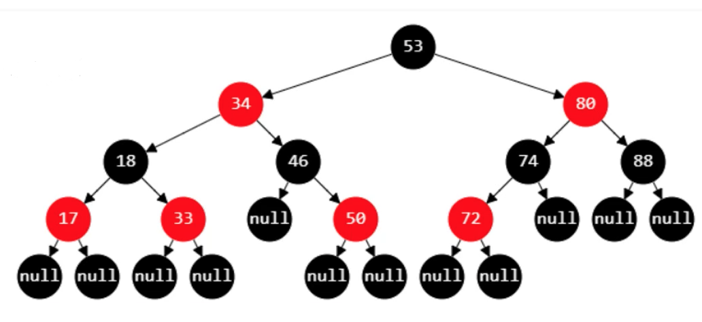

## 一 红黑树

红黑树（Red Black Tree）是一种自平衡的二叉搜索树，以前也称为平衡二叉B树（Symmetric Binary B-tree）。   

如图所示：  
  

红黑树除了符合二叉搜索树的基本规则外，还添加如下特性：
- 1.节点是红色/黑色
- 2.根节点是黑色
- 3.叶节点都是黑色空节点（叶节点是假想出来的节点）
- 4.红色节点的子节点都是黑色，也意味着从叶节点到根节点的所有路径上不会有两个连续的红色节点
- 5.从任一节点开始，到达每个叶节点的路径中，都具有相同数量的黑色节点

下图就不是一棵红黑树，因为55-38-25路过了3个黑色节点，但是55-38->38的right节点是2个黑色节点，不满足第5个性质。  
  

红黑树与四阶B树（2-3-4树）具有等价性质，如下所示红黑树可以“变形”为类似四阶B树的样子：  
    

在该图中，红黑树通过以下操作，实现了到四阶B树的转换：
- 黑色节点与其红色子节点融合在一起
- 所以红黑树的黑色节点的个数与4阶B树的节点总个数相同

具体的红黑树与四阶B树的转换如下所示：  
 

红黑树依据上述的规则，达到了平衡：**从根节点到叶节点的最长路径，不会超过最短可能路径的两倍长！！**，虽然红黑树没有做到绝对平衡，但可以保证在最坏的情况下，仍然是高效的：
- 性质4决定了路径不能有两个相连的红色节点
- 最短可能路径都是黑色节点
- 最长可能路径是红色、黑色交替存在
- 性质5所有路径都有相同数目的黑色节点 

##  二  红黑树常见操作

### 2.1 插入节点

插入的节点默认都是红色的，因为如果是黑色的，必然会导致有一条路径上多了黑色节点，违反了性质5，调整难度较大！如果是红色则有可能直接就满足上述5个规则了，即使出现了红红相连的情况，也可以通过颜色调换来进行调整。  

