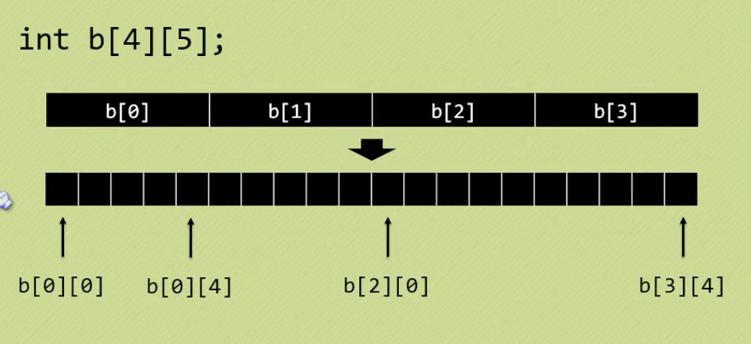

# 06-数组

## 一 数组概述

数组就是在内存中连续的相同类型的变量空间：

- 各个数据的排列有一定的规律，下标代表数据在数组中的序号
- 数组中每个元素都属于同一个数据类型，不能把不同类型的数据放在同一个数组中

通常情况下，数组元素下标的个数也称为维数，根据维数的不同，可将数组分为一维数组、二维数组、三维数组、四维数组等。通常情况下，我们将二维及以上的数组称为多维数组。

## 二 数组的使用

### 2.1 数组定义

数组的定义：

```c++
int a[10];  // 数组名为 a ，下标从0开始，最大索引为 9
int b[3+5]; // 该定义方式合法
```

不合法的定义：

```c++
int n;
int a[n]; // C语言不允许对数组的大小做动态定义
```

在非主函数的函数中，数组长度可以是变量或者非常量表达式：

```c++
void fn(int n) {
    int a[2 * n];  // 这是一个可变长数组，注意不能使用static修饰
}
```

### 2.2 数组初始化

```c++
int a[5] = {0};     // 未赋值部分自动设为0
int b[5] = {0,1};   // 只给一部分赋值，没赋值的默认为0
int c[5] = {0,1,2,3,4}
int d[] = {0,1,2,3,4,5} // 给全部元素赋值时，可以不指定数组长度
```

## 三 二维数组

二维数组常称为矩阵（matrix），定义：`类型说明符 数组名[常量表达式][常量表达式]`

```c++
float arr1[3][6];           // 3行6列
```

二维数组初始化：

```c++
int a[3][2] = {{1,2},{5,6},{9,7}};
int b[3][2] = {1,2,5,6,7,9}; // 效果和上一行一致，但是表述不清晰
int c[3][4] = {{1},{5},{9}}; // 也可以部分赋值，其余自动为0

// 注意：二维数组的初始化可以忽略第1维的元素个数，让编译器自己计算数组长度
int d[][4] = {{1,2,3,4}, {4,6,7,8}};
```

二维数组的访问：

```c++
a[0][3]; // 访问第一行第四列数据
```

二维数组的元素在内存中仍然是连续线性存放的，不是抽象出来的矩阵形象，如下所示：


